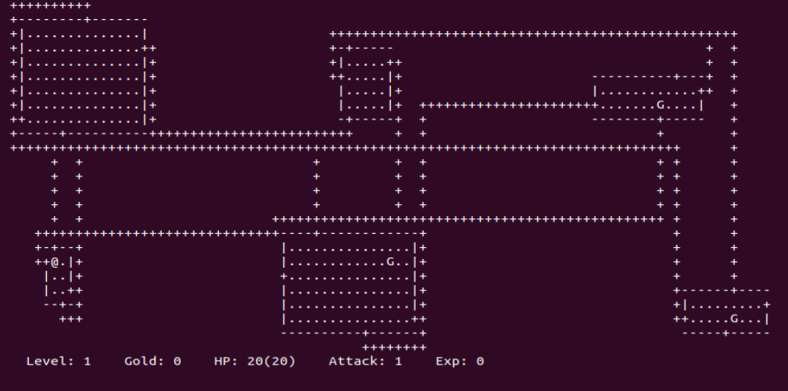

# rogue-rpg
ASCII-style Rogue RPG

Based on the ncurses library. Based on https://www.youtube.com/c/badcodinghabits 

RPG game with randomly generated levels. Useful for learning some object-oriented concepts in pure C style. Heavy use of structs, union, enum.

# Upcoming

- ~~Go to next level when reaching the end of the level~~
- ~~The player increases its level when reaching certain threshold of exp, getting better stats~~
- ~~The seeking monster only move randomly when the plyer is not in the same room~~
- ~~The player has a detection range~~
- Item (weapons, potions, armor) can be looted, equipped/used, found in chests **[In progress]**
- Some pop-ups for better understanding of what is going on **[In progress]**
- And more ...
