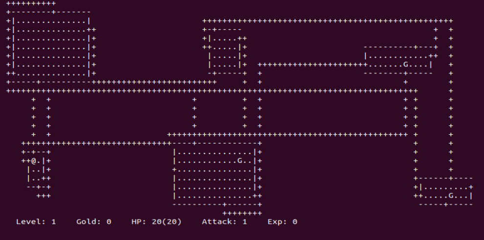

# rogue-rpg
ASCII-style Rogue RPG



Based on the ncurses library. Based on https://www.youtube.com/c/badcodinghabits 

RPG game with randomly generated levels. Useful for learning some object-oriented concepts in pure C style. Heavy use of structs, union, enum.

## Getting Started

These instructions will get you a copy of the project up and running on your local machine for development and testing purposes.

### Prerequisites

- Conda (Miniconda or Anaconda)

### Installation and Running

1.  **Create and activate the Conda environment:**
    The `rogue_dev_env.yml` file specifies the necessary dependencies (`make`, `ncurses`, `doxygen`).
    ```bash
    conda env create -f rogue_dev_env.yml -n rogue_dev
    conda activate rogue_dev
    ```
    *Note: If you encounter issues with environment creation, ensure your Conda installation is up to date.*

2.  **Build the game:**
    The included `makefile` handles the compilation.
    ```bash
    make
    ```

3.  **Run the game:**
    ```bash
    ./rogue
    ```
    Alternatively, you can use the makefile target:
    ```bash
    make run
    ```

# Upcoming

- ~~Go to next level when reaching the end of the level~~
- ~~The player increases its level when reaching certain threshold of exp, getting better stats~~
- ~~The seeking monster only move randomly when the plyer is not in the same room~~
- ~~The player has a detection range~~
- Item (weapons, potions, armor) can be looted, equipped/used, found in chests **[In progress]**
- Some pop-ups for better understanding of what is going on **[In progress]**
- And more ...
